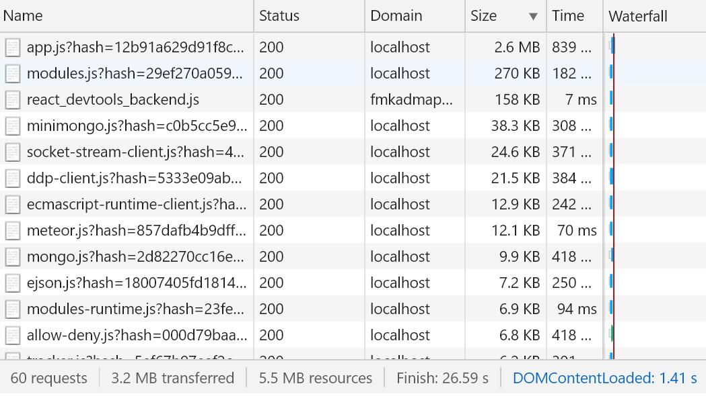
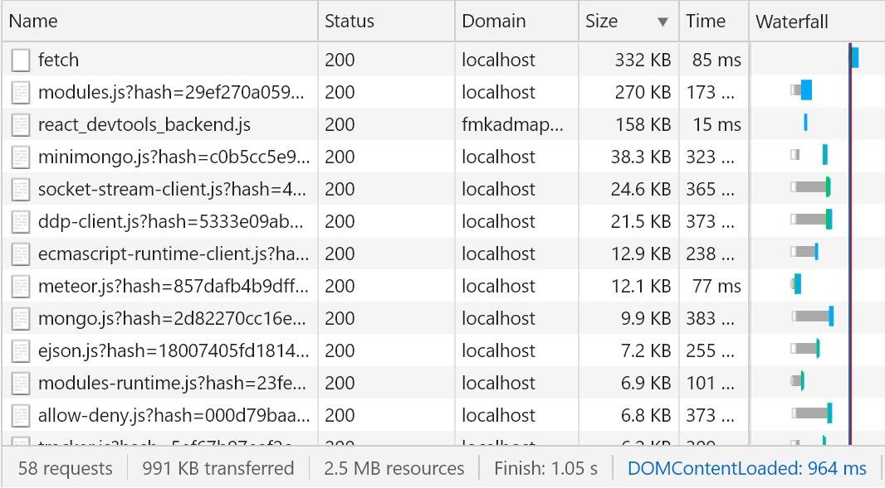
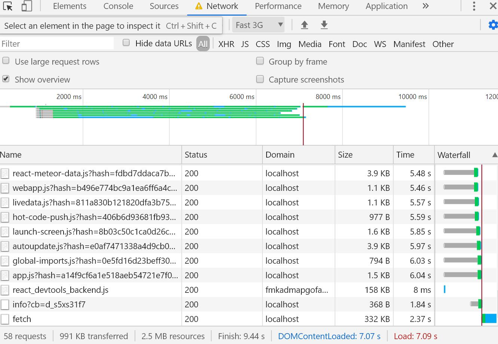
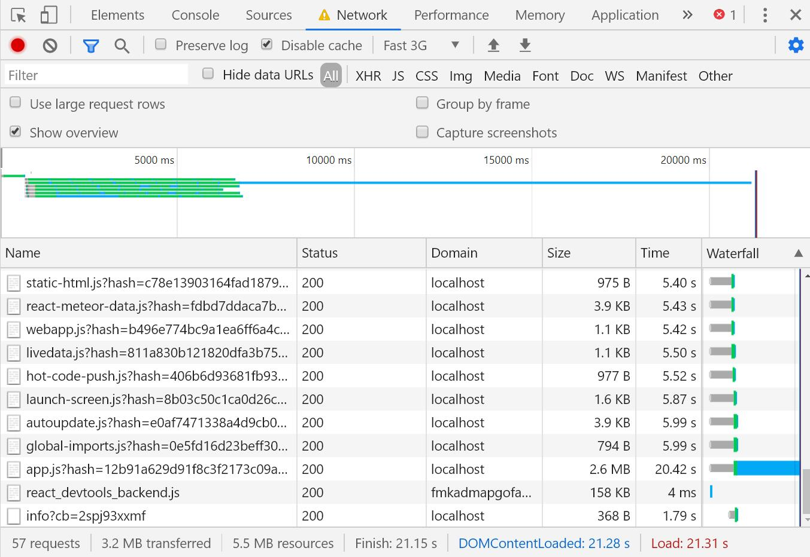
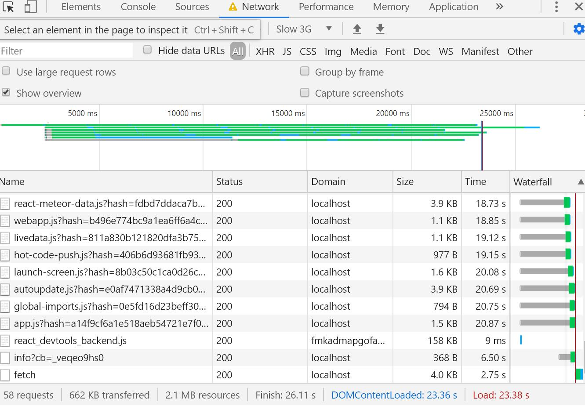
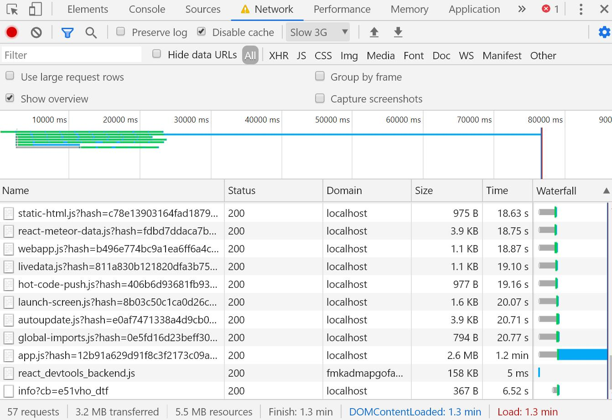

# meteor dynamic import vs none

When your meteor project grow big more resources the browser need to load, and slower they can see the page. So we need to split resources and load in need

Here we can use dyamic import to split the resources, so the [meteor-dynamic-import](./meteor-dynamic-import) folder has split and [meteor-none-dynamic](./meteor-none-dynamic) has not

## compare result

befor split


- the resource files are bigger, app.js=2.6M because all pages packed in app.js
- the load time slower, 1.4s

after split


- the resource files are smaller, largest file 332kb, shall be the current page
- the load time quicker, 1s, about 2/3 of before

### more different on mobiles

|  |dyamic import  | none dyamic |
| ------------- | ------------- | ------------- |
| fast 3G |   |    |
| slow 3G |   |    |

## how to split

the code looks like this, you can refer [./meteor-dynamic-import/imports/ui/App.jsx](./meteor-dynamic-import/imports/ui/App.jsx)

```
import('./comps/A1').then(Page => {
          let arr = pages.concat()
          arr[curPage] = Page.default
          setPages(arr)
        })
```

## try them yourself

```
cd meteor-none-dynamic
meteor npm i
meteor
# open http://localhost:3000
```

```
cd meteor-dynamic-import
meteor npm i
meteor
# open http://localhost:3000
```